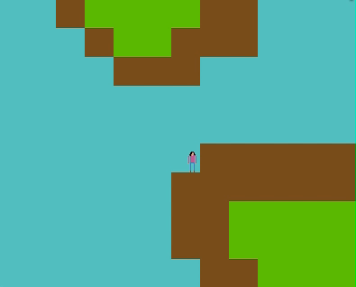
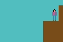
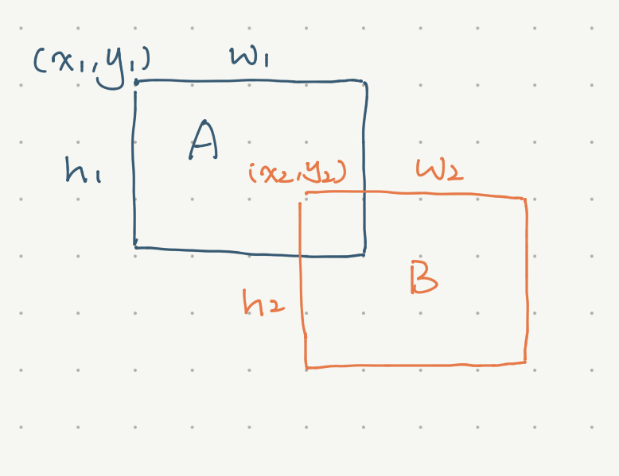

# Graphics-Final-Project

This is a mini game built using the SDL library. I set up the environment and the game window from scratch. In this game, players can use the keyboard to make the character walk around a terrain. Unique features include a simple tilemap, sprite animation, and collision detection.

## How to build and run

**MacOS**

Open terminal to the directory containing this repository.

```
Graphics-Final-Project $ make game
Graphics-Final-Project $ ./play
```

## Demo

<br />



## Data structures and background math

**Tilemap**

A tilemap is a two-dimensional array of integers. In the tilemap I create, each integer represent a kind of landscape -- 0 is water, 1 is land, 2 is grassland. I used GIMP to create simple 32 * 32 color blocks as textiles.

**Sprite Animation**

- Animation function:

    *xpos = width * time % f*, 

    where *xpos* is the character's start position on the x-axis, *width* is the width of the sprite sheet, *time* is the time since the SDL library's initialization, and *f* is the frame number.

- The sprite sheet doesn't contain animation for walking left, so I use the `SDL_FLIP_HORIZONTAL` function to flip the sprite animation when the character walks left.

**Collision Detection**

- The character bounces back when he collides into something. 



- A and B collide when:

    - x1 + w1 >= x2,

    - x2 + w2 >= x1,

    - y1 + h1 >= y2,

    - and y2 + h2 >= y1

- The bounce-back functionality is done by changing the character's velocity to -1 when a collision is detected.

## Next steps

Good-to-have:
- Scrollable tilemap

Stretch:
- Audio
- Entity Component System