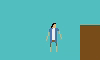

# Graphics-Final-Project

This is a mini game built using the SDL2 library. I set up the environment and the game window from scratch. In this game, players can use the keyboard to make the character walk around a terrain. Unique features include a simple tilemap, sprite animation, and collision detection.

## How to build and run

**MacOS**

Open terminal to the directory containing this repository.

```
Graphics-Final-Project $ make game
Graphics-Final-Project $ ./play
```

## Demo

<br />



## Data structures and background math

**Tile Map**

A tile map is a two-dimensional array of integers. In the tile map I create, each integer represent a kind of landscape -- 0 is water, 1 is land, 2 is grassland. 

**Sprite Animation**

xpos = width * time % f

where xpos = start position on the x-axis,

width = image width,

time = time since SDL library initialization,

and f = frame number

**Collision Detection**


A and B collide when:

- x1 + w1 >= x2,

- x2 + w2 >= x1,

- y1 + h1 >= y2,

- and y2 + h2 >= y1

## Next steps

Good-to-have:
- Multiple animations
- Scrollable tilemap

Stretch:
- Entity Component System